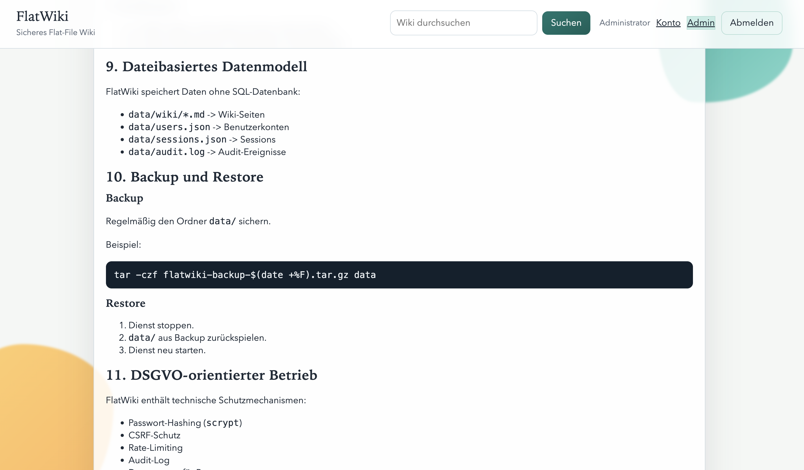

# FlatWiki

FlatWiki ist ein modernes, durchsuchbares Flat-File-Wiki mit Login, Rollen, Admin-Benutzerverwaltung und Markdown-Seiten.

## Open Source

- Lizenz: [MIT](LICENSE)
- Drittanbieter-Hinweise: [THIRD_PARTY_LICENSES.md](THIRD_PARTY_LICENSES.md)
- Sicherheitsmeldungen: [SECURITY.md](SECURITY.md)
- Mitwirken: [CONTRIBUTING.md](CONTRIBUTING.md)

## Features

- Flat-File statt SQL-Datenbank
- Wiki-Seiten als Markdown (`data/wiki/*.md`)
- Login/Logout
- Admin-Bereich für Benutzerverwaltung
  - Benutzer anlegen, bearbeiten, deaktivieren, löschen
  - Rollen (`admin`, `user`)
  - Passwort-Reset
- Benutzerkonto-Funktionen
  - eigenes Passwort ändern
  - eigene Daten exportieren (inkl. eigener Artikelübersicht + Markdown-Speicherdump)
  - Übersicht über selbst erstellte Artikel im Konto-Bereich
- Kategorien (eine Kategorie pro Artikel)
- Zugriff pro Artikel (`alle` oder `nur ausgewählte Benutzer`)
- Optionale AES-256-Verschlüsselung pro Artikel
- Volltextsuche
- Live-Vorschläge im Suchfeld während der Eingabe
- Pagination für Übersicht, Inhaltsverzeichnis und Suche
- Inhaltsverzeichnis (`/toc`)
- Bild-Upload im Editor (1-x Dateien, automatische eindeutige Dateinamen)
- Kategoriebezogene Upload-Pfade (`/uploads/<kategorie-ordner>/...`)
- Visueller Markdown-Editor (Toolbar + Live-Vorschau)
- Automatische Artikel-Navigation (links) aus Markdown-Überschriften
- Admin-Bildverwaltung mit Referenzprüfung (`/admin/media`)
  - zeigt pro Bild, ob es eingebunden ist und in welchen Artikeln
  - Scanner zum Löschen ungenutzter Bilder
  - optional erzwungenes Löschen auch bei aktiver Einbindung
- Admin-Suchindex-Verwaltung (`/admin/index`)
  - Suchindex-Datei manuell neu generieren
  - Live-Fortschritt mit Progress-Balken
- Beim Löschen eines Artikels: automatische Entfernung nicht mehr referenzierter Upload-Bilder
- Admin-Kategorienverwaltung (`/admin/categories`)
- Visueller Setup-Assistent beim ersten Start (`/setup`)
- Sicherheitsgrundlagen: `scrypt`, CSRF, Rate-Limit, Security-Header, Audit-Log

## Screenshot



## Starten

### Option A: Node.js + npm

Voraussetzungen: Node.js 20+, npm

```bash
./install.sh
npm install
npm run dev
```

Danach im Browser öffnen und Setup abschließen:

- [http://127.0.0.1:3000/setup](http://127.0.0.1:3000/setup)

Produktion:

```bash
npm run build
npm start
```

### Option B: Docker

Voraussetzungen: Docker Engine + Compose + Buildx

```bash
./install.sh
docker compose up -d --build
```

Hinweis: `HOST=0.0.0.0` in `config.env` belassen (Standard in `config.env.example`).

### Docker auf Ubuntu installieren (inkl. Buildx)

Wenn `docker-buildx-plugin` in den Standard-Ubuntu-Repos fehlt, nutze das offizielle Docker-Repository:

```bash
sudo apt-get update
sudo apt-get install -y ca-certificates curl
sudo install -m 0755 -d /etc/apt/keyrings
sudo curl -fsSL https://download.docker.com/linux/ubuntu/gpg -o /etc/apt/keyrings/docker.asc
sudo chmod a+r /etc/apt/keyrings/docker.asc
echo "deb [arch=$(dpkg --print-architecture) signed-by=/etc/apt/keyrings/docker.asc] https://download.docker.com/linux/ubuntu $(. /etc/os-release && echo ${UBUNTU_CODENAME:-$VERSION_CODENAME}) stable" | sudo tee /etc/apt/sources.list.d/docker.list > /dev/null
sudo apt-get update
sudo apt-get install -y docker-ce docker-ce-cli containerd.io docker-buildx-plugin docker-compose-plugin
docker buildx version
docker compose version
```

Optional (ohne `sudo` für Docker-Kommandos):

```bash
sudo usermod -aG docker "$USER"
newgrp docker
```

Danach FlatWiki starten:

```bash
./install.sh
docker compose up -d --build
```

Logs:

```bash
docker compose logs -f
```

Stoppen:

```bash
docker compose down
```

Aufruf:

- [http://127.0.0.1:3000](http://127.0.0.1:3000)
- beim ersten Start: [http://127.0.0.1:3000/setup](http://127.0.0.1:3000/setup)

### Docker-Fehlerbehebung

- Fehler `fork/exec ... docker-buildx: exec format error`: Es liegt oft ein falsches manuelles Plugin unter `~/.docker/cli-plugins/docker-buildx`.
- `docker compose pull` ist hier nicht erforderlich, da lokal gebaut wird. Nutze `docker compose up -d --build`.
- Fix:

```bash
rm -f ~/.docker/cli-plugins/docker-buildx
sudo apt-get install --reinstall -y docker-buildx-plugin
docker buildx version
docker compose up -d --build
```

## Wichtige Hinweise

- Der erste Admin wird standardmäßig über den Setup-Assistenten (`/setup`) angelegt.
- `BOOTSTRAP_ADMIN_PASSWORD` ist optional für Headless-Bootstrap und wird nur beim Erststart genutzt (wenn `data/users.json` leer ist).
- `PASSWORD_PEPPER` nach dem ersten produktiven Start nicht mehr ändern, sonst funktionieren bestehende Passwörter nicht mehr.
- `CONTENT_ENCRYPTION_KEY` nach produktivem Start nicht mehr ändern, sonst können bestehende verschlüsselte Artikel nicht mehr gelesen werden.
- Keine Secrets committen. `config.env` bleibt lokal; nur `config.env.example` wird versioniert.
- Uploads liegen in `data/uploads/` (pro Kategorie in Unterordnern) und werden als `/uploads/...` bereitgestellt.

## Erstes Admin-Konto

Beim ersten Start öffnest du `/setup` und legst dort den ersten Admin an:

- Admin-Benutzername
- Anzeigename
- Passwort

Optional (ohne UI): Wenn `BOOTSTRAP_ADMIN_PASSWORD` gesetzt ist, wird beim Erststart automatisch ein Admin erstellt.

Hinweis: Existiert bereits ein Konto in `data/users.json`, wird `/setup` übersprungen.

### Admin-Passwort per CLI zurücksetzen (Docker)

Wenn das Login nicht mehr funktioniert, kannst du das Admin-Passwort direkt neu setzen:

```bash
cd /pfad/zu/FlatWiki
# Diese Variable wird in der nächsten Zeile als $NEW_ADMIN_PASSWORD verwendet.
# Nur normale ASCII-Anführungszeichen verwenden: '...'
NEW_ADMIN_PASSWORD='DeinSicheresPasswort123!'
docker compose exec -T -e NEW_ADMIN_PASSWORD="$NEW_ADMIN_PASSWORD" flatwiki node - <<'NODE'
const fs = require('fs');
const crypto = require('crypto');

const usersPath = '/app/data/users.json';
const username = 'admin';
const newPassword = process.env.NEW_ADMIN_PASSWORD;
const pepper = process.env.PASSWORD_PEPPER || '';
const N = 1 << 14, R = 8, P = 1, KEYLEN = 64, MAX_MEM = 64 * 1024 * 1024;

if (!newPassword) throw new Error('NEW_ADMIN_PASSWORD ist leer');

const users = JSON.parse(fs.readFileSync(usersPath, 'utf8'));
const user = users.find((u) => (u.username || '').toLowerCase() === username);
if (!user) throw new Error('Admin-User nicht gefunden');

const salt = crypto.randomBytes(16);
crypto.scrypt(`${newPassword}${pepper}`, salt, KEYLEN, { cost: N, blockSize: R, parallelization: P, maxmem: MAX_MEM }, (err, dk) => {
  if (err) throw err;
  user.passwordHash = `scrypt$${N}$${R}$${P}$${salt.toString('base64')}$${Buffer.from(dk).toString('base64')}`;
  user.updatedAt = new Date().toISOString();
  fs.writeFileSync(usersPath, JSON.stringify(users, null, 2) + '\n');
  console.log('Admin-Passwort neu gesetzt.');
});
NODE
```

## Konfiguration

Datei: `config.env`

Installer:

- `./install.sh` erstellt/ergänzt `config.env` automatisch und generiert sichere Einmalwerte.
- Beim ersten App-Start ergänzt FlatWiki fehlende Schlüssel ebenfalls automatisch.

Pflicht in Produktion:

- `COOKIE_SECRET` (langes zufälliges Secret)

Optional:

- `PASSWORD_PEPPER`
- `BOOTSTRAP_ADMIN_USERNAME`
- `BOOTSTRAP_ADMIN_PASSWORD`
- `WIKI_TITLE`

## Artikel-Editor

- Bilder können direkt im Editor hochgeladen werden.
- Pro Upload sind mehrere Dateien möglich (1-x).
- Dateinamen werden automatisch in eindeutige Namen umbenannt.
- Nach dem Upload werden die Markdown-Bildlinks automatisch in den Artikelinhalt eingefügt.
- Toolbar für schnelle Formatierung (Überschriften, Listen, Links, Code, Tabelle).
- Live-Vorschau im Editor per Button auf "Vorschau".
- Überschriften (`##`, `###`, ...) erzeugen automatisch eine linke Artikel-Navigation.
- Format-Hilfe als Wiki-Seite: `/wiki/markdown-formatierung-howto`

## Bildverwaltung und Cleanup

- Admins können unter `/admin/media` alle Upload-Dateien verwalten.
- Für jede Datei zeigt FlatWiki:
  - ob sie eingebunden ist
  - in welchen Artikeln sie referenziert wird
  - Dateigröße und Änderungszeit
- Der Button "Ungenutzte Bilder löschen" entfernt alle nicht referenzierten Dateien automatisch.
- Beim Löschen einer Wiki-Seite werden deren Bildreferenzen geprüft und danach ungenutzte Upload-Dateien ebenfalls automatisch entfernt.

## Repository-Struktur

```txt
.
├─ .github/
│  └─ workflows/
│     └─ ci.yml
├─ .gitattributes
├─ .dockerignore
├─ .editorconfig
├─ Dockerfile
├─ docker-compose.yml
├─ config.env.example
├─ install.sh
├─ data/
│  └─ wiki/
├─ public/
├─ src/
├─ LICENSE
├─ README.md
├─ SECURITY.md
└─ CONTRIBUTING.md
```
